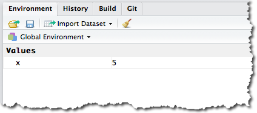
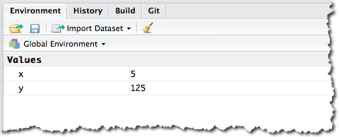

```{r echo = FALSE, message = FALSE}
library(tidyverse)
```

There are some basics of using R that will quickly become second nature. But, it seems worth running through them first as a starting point.

## Basic Operations
At its most basic, R can perform operations (like math(s)) simply by typing an expression in the console and pressing <Enter>:
```{r basics-base-r}
12^2
```
When an expression is entered in the RStudio console, it simply executes and returns the result. In the example above, the result returned is the result of the square of 12.

This is also an example of using the console as a "scratchpad" -- we just wanted to do something, get the result, and move on along. So, we didn't put this operation in a script.


## <-
As a programming language, R has variables (or "objects") that "things" get assigned to (values, functions, other variables). These assignments use the `<-` operator. For instance, to assign the value `5` to a variable called `x`, we write:
```{r}
x <- 5
```
You may wonder why this isn't `x=5`...and a real programmer could probably give you a great explanation. The `=` _does_ get used in R, and it _can_ often be used instead of `<-`, but that's not generally a good idea. When we _define_ functions and when we _call_ functions, we _do_ use the `=` sign to assign or pass values into the function. But, that will become clear later.

We now have an object `x` that has a value of `5` in our environment. As a matter of fact, if we check out the **Environment** pane at the top right of RStudio, we'll see that that is the case:

<div align="center"></div>

That's a pretty boring **Environment** for the moment. But, as we start doing real work with R, it will get loaded up with lots of objects -- and objects of different types ("classes") -- at which point it will start to get really handy.

So, we have an object `x`, and we can perform operations on that object from the script editor or, for now, from the console:

```{r}
x * 1000
```

Or, we can use `x` in an expression that creates another object:
```{r}
y <- x^3
```

Now, if we check out the **Environment** pane, we'll see _two_ objects in it:

<div align="center"></div>

This still isn't exciting, but what did you expect from "the basics?" We can also inspect our new object by typing `y` at the prompt:
```{r}
y
```

**Handy shortcut**: Press `ALT -` to create the assignment operator, `<-`.

## R is Case-Sensitive
R is case-sensitive, so `gaData` is a totally different object from `gadata` (and `x` is different from `X`). Depending on how well you type and how closely you pay attention to the details, this is an easy way to get tripped up.

One more time: **R IS CASE-SENSITIVE**.

## Functions
Functions are fundamental to any programming language, and R is no different. There are three main sources for functions.

### Defined in Base R

There are many-many of these, and we will touch on some common ones throughout this class. Consider the code below:
```{r}
sum(c(1,2,2,3,3,3,4,4,4,4,5,5,5,5,5))
```

This code uses two functions:

* `c()` -- this is the Base R "combine" function. In this example, it's creating a "vector" of numeric values
* `sum()` -- this is just like the `SUM()` function in Excel. It finds the sum of the values within it

As shown, the result is the sum of the combined values.

### Defined in Packages
When you install a package, what you're really doing is adding more functions to the universe in which you are working. These work _exactly_ like the Base R functions described above. Although, as described in the [packages](packages.html) section, you have to have the package installed (using the Base R function `install.packages()` to install the package and then the `library()` function -- within your script -- to load it).

_Annoying aside_: Are you wondering what happens if you have two packages installed and loaded that have an identically named function? It happens! By default, if you call a function that exists in two different packages that are both loaded, then the version of the function from the _last_ package loaded will be used. But, you can also specify which package you want to use the function from using a `::`. For instance, if you have both the `plyr` and `dplyr` packages loaded, and you want to ensure that you use the `summarise` function from the `dplyr` package, you can call the function using `dplr::summarise()`.

### Defined in Your Script
Both to organize your code and, more importantly, to prevent repeating the same code within a single script, you can define functions within your script that you then call from elsewhere in the script. This can be a little confusing, but it's also extremely handy.

```{r}

# Define a function called 'cubeValue'
cubeValue <- function(x){
  cat("The cube of ",x," is ",x^3,".\n",sep="")
}

# Loop through the numbers 1 through 3 and print the cube of each.
for (i in 1:3){
  cubeValue(i)
}

```

The example above should look very familiar if you've worked in almost any programming language:

* We defined a function named `cubeValue` (using the `<-` assignment operator)
* That function was set up to take in a single value (functions can take multiple "arguments," and those arguments can be assigned names, but we're keeping it simple here), and that value is then used in the function as `x`.
* A loop goes through and successfully calls the function with the values `1`, `2`, and then `3`.

One thing that is fairly unique to R is that, in general, _loops should be avoided_. R has the ability to "apply" a function to an entire list of values at once. Consider the code below:
```{r message=FALSE}

# Define a function called 'cubeValue'. Note this is identical to the function
# defined in the first example above.
cubeValue <- function(x){
  cat("The cube of ",x," is ",x^3,".\n",sep="")
}

# Apply the function to a "vector" of values--1 through 3--using the `map` function from the
# `purrr` package. This actually returns a list, which we'll cover later, and we're assigning 
# that to an object called 'foo' that we're not actually doing anything with. But, as the 
# function is running, it's still printing out the results as it goes. This same result could
# have been achieved with the `sapply` function from "base R` rather than `map` from the 
# Tidyverse, but getting into the `map` family is just a good habit if you're working in the
# Tidyverse.
foo <- map(c(1:3), cubeValue)
```

Becoming familiar with the `apply` functions (mainly `sapply()` and `lapply()`) will help unlock a lot of R's power.

We'll dig much more deeply into functions later, as they not only are very powerful, but their proper use is key to good programming practices.

### Function Help
There will be countless functions that we start to use, and it's often handy to quickly see the documentation for a function. The `?` provides quick access on that front. Type `?cat` or `?cat()` and, in the lower right pane in RStudio, the help file for the `cat()` function will appear. As we start to use more complicated functions, the help files are often a very handy reference. Unfortunately, the quality of that documentation can vary, so, with functions embedded in specialized packages, the `?` help may just be a jumping off point, after which more digging online is required to get workable code examples. Function help files often use a lot of shortcuts that assume a moderate level of R knowledge on the part of the reader, so they can seem like Greek at first. The more you use R and get comfortable with the style of the help files, though, the easier they become to read.

## The Working Directory
Typing `getwd()` in the console returns your "working directory." This is just "where R is doing stuff." Tutorials tend to make a big deal about your working directly (not just `getwd()`, but its companion, `setwd()`). Generally, you won't really need to worry about these. If your working directory gets out of whack, it will cause your scripts to have issues, so it's just good to file the concept of a working directory away.

## Working with Scripts
Scripts are actually "programs" that get saved as text files so they can be used over time. New scripts are created by selecting **File>>New File>>R Script** (we'll cover projects in a bit).

## 'Run' vs. 'Source'
There are two main ways to _execute_ scripts. You will use both of them:

* **Source** -- when you click **Source**, the _entire_ script runs.
* **Run** -- when you click **Run**, only the _selected portion_ of the script runs. 

**Run** comes in very handy when, for instance, you already have data loaded into your environment (possibly through API calls that took a little time to run), and you just want to debug and add to additional code. Or, when you're trying to figure out the exact syntax for getting to the subset of data you're looking for and want to repeatedly run the same small section of a script as you tweak it.

**Handy shortcut:** The keyboard shortcut for **Run** is `CMD-ENTER` (`CTRL-ENTER` on Windows). If you simply have the cursor on a line of code, it will run just that line of code. If you have code _highlighted_ when you use this shortcut, then it will run the highlighted code.

## Commenting Code
Comments are critical to any programming language, as their core purpose is to actually embed documentation within the code itself. In R, comments are denoted with a `#`. Comment profusely and often!
```{r commenting}
# This is what a comment looks like. If your comment goes on for a while (which
# is fine), then press <Enter>, add another '#', and continue commenting.
```
Comments are _also_ handy for temporarily halting the execution of portions of your script. If, for instance, you're trying a couple of different ways to do something, you may want to keep the original way, but just comment it out while you try an alternative.

**Handy shortcut:** To quickly comment/un-comment a section of code in RStudio, highlight the rows you want to toggle commenting on and press `CMD-SHIFT-C` (`CTRL-SHIFT-C` on Windows).

## The Up Arrow
This is also a fairly standard convention, but it comes in very handy in the console. Pressing the "up" arrow at the console prompt will load the previously entered command. Continuing to press the "up" arrow will cycle back through commands already executed. This is useful when you either want to exactly repeat a command _or_ when you want to simply tweak a command -- press "up" until the command is loaded, and then edit it before pressing `ENTER` to execute.
