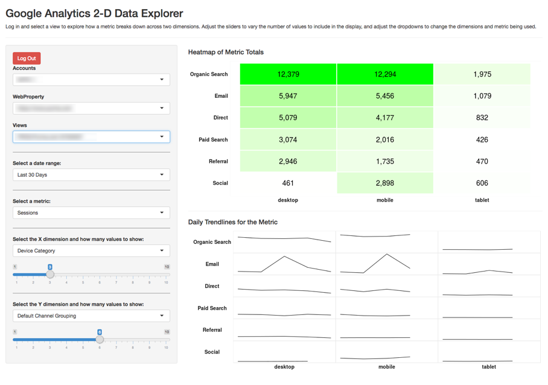

```{r example2-setup, include=FALSE}
knitr::opts_chunk$set(echo = TRUE)
```

This is an example of a "Shiny" application built with R -- a web-based application that allows the user to interact with the data directly. You can try it out at  [https://gilligan.shinyapps.io/ga-data-explorer/](https://gilligan.shinyapps.io/ga-data-explorer/).



Some keys to the underlying functionality used to build this:

* The `googleAnalyticsR` package -- one of several packages available for pulling data from Google Analytics 
* The `shiny` package -- Shiny is a package that makes R scripts interactive and web-based.
* The `ggplot2` package -- the visualizations are all built using the plotting capabilities of ggplot2

## The Code

This code may look a bit intimidating. But, notice that much of the "code" is actually just comments explaining what the code is doing. So, even without fully following all aspects of the code, it is relatively easy for someone moderately familiary with R to take the code and tweak it here and there to suit their specific needs. 

```{r eval=FALSE}

#
# App to explore Google Analytics metrics across two dimensions. The user has to authenticate
# and choose a view.
#

library(shiny)              # We must web-enable this whole thing
library(googleAuthR)        # To prompt for authentication by the user
library(googleAnalyticsR)   # For the pulling of the data
library(tidyverse)          # For data transformations -- primarily just uses dplyr commands
library(scales)             # Cuz, ya' know, commas in displayed numbers

####################
# Set up the different options for interaction
####################

# DATE OPTIONS
# This could also be set as date selectors easily enough, but, for now, it's just set
# as some preset options. As a note, even though the values are being set as numerics 
# here, they actually get treated as characters, so they have to be converted 
# back to numerics when setting start_date in the get_data() function.
daterange_options <- list("Last 7 Days" = 7,
                          "Last 30 Days" = 30,
                          "Last 60 Days" = 60,
                          "Last 90 Days" = 90)

# METRIC OPTIONS
# As currently written, these can only be # summable metrics, as the data gets pulled
# once as daily data and # then gets aggregated (and would require much more 
# hoop-jumping to then do weighted averages to get 'rates' of any sort).
metric_options <- list("Sessions" = "sessions",
                       "Pageviews" = "pageviews",
                       "Total Events" = "totalEvents",
                       "Bounces" = "bounces",
                       "New Users" = "newUsers")

# DIMENSION OPTIONS
# The first value can be anything, but the second value needs to be the Google 
# Analytics API value.
dimension_options <- list("New vs. Returning" = "userType",
                          "Device Category" = "deviceCategory",
                          "Mobile Device Brand" = "mobileDeviceBranding",
                          "Country" = "country",
                          "Browser" = "browser",
                          "Operating System" = "operatingSystem",
                          "Default Channel Grouping" = "channelGrouping",
                          "Source" = "source",
                          "Medium" = "medium",
                          "Campaign" = "campaign")

####################
# Define base theme You have an option of tweaking settings
# here OR in the actual functions/output that use default_theme
####################

default_theme <-   theme_bw() +
  theme(axis.text = element_text(face = "bold", size = 14, colour = "grey10"),
        axis.title = element_blank(),
        axis.ticks = element_blank(),
        axis.line = element_blank(),
        legend.title = element_blank(),
        legend.background = element_blank(),
        legend.position = "none",
        legend.justification = "center",
        strip.text.x = element_text(face = "bold", size = 14, colour = "grey10"),
        strip.text.y = element_text(face = "bold", size = 14, colour = "grey10", angle = 180),
        strip.background = element_blank(),
        panel.border = element_blank(),
        panel.grid.major = element_blank(),
        panel.grid.minor = element_blank(),
        panel.spacing = unit(0,"in"),
        panel.background = element_rect(fill = NA, color = "gray90"))

################
# Define non-reactive functions (used by reactive conductors). This should keep
# from needlessly querying/crunching the data multiple times when an update is
# made. The raw data is needed for both visualizations, but we only need to pull
# it once.
################

# Get the values to be used for the X dimension. This is based on the *totals* for
# the selected metric *just* for the X dimension values (ignores the Y-dimension)
# values -- sorting all of the results and then taking the top values based on
# the slider selection. 
calc_dim_x_includes <- function(data, dim_count){
  group_by(data, dim_x) %>% summarise(total = sum(metric)) %>%
    arrange(-total) %>% top_n(dim_count, total) %>% select(dim_x)
}

# This does the same as the above, but for the Y dimension. These probably could
# have been a single function, as they're very similar, but it seemed a little
# more readable just to do them separately.
calc_dim_y_includes <- function(data, dim_count){
  group_by(data, dim_y) %>% summarise(total = sum(metric)) %>%
    arrange(total) %>% top_n(dim_count, total) %>% select(dim_y) 
}

######################
# Define the UI
######################

ui <- fluidPage(
  
  # Include Google Tag Manager container (put the file in the same
  # folder as app.R). Remove the <script> tags and the comments from the GTM script.
  tags$head(includeScript("gtm.js")),
  
  theme = "cosmo",   # Change to a different theme to slightly alter the look and feel as desired
  
  # Application title
  titlePanel("Google Analytics 2-D Data Explorer"),
  "Log in and select a view to explore how a metric breaks down across two dimensions.",
  "Adjust the sliders to vary the number of values to include in the display, and adjust ",
  "the dropdowns to change the dimensions and metric being used.",
  
  tags$hr(),
  
  # Sidebar with the user-controllable inputs 
  sidebarLayout(
    sidebarPanel(
      
      # A bit of a hack, I suspect, but just centering the login button
      tags$div(style="text-align: center;",
               
               # Get the user to log in and then select a view. This uses the JS version
               # because it seems to be less finicky.
               gar_auth_jsUI("auth_module", login_text = "Login with Google")
      ),
      
      # Get the account/property/view
      authDropdownUI("auth_menu"),
      
      # Horizontal line just to break up the settings a bit.
      tags$hr(style="border-color: #777777;"),
      
      # The date range dropdown, including a default value
      selectInput("daterange", label = "Select a date range:", 
                  choices = daterange_options, 
                  selected = 30),
      
      # Horizontal line just to break up the settings a bit.
      tags$hr(style="border-color: #777777;"),
      
      # The metric dropdown
      selectInput("metric", label = "Select a metric:", 
                  choices = metric_options, 
                  selected = "sessions"),
      
      # Horizontal line just to break up the settings a bit.
      tags$hr(style="border-color: #777777;"),
      
      # The dimension selector (dropdown) for the X-dimension
      selectInput("x_dim", label = "Select the X dimension and how many values to show:", 
                  choices = dimension_options, 
                  selected = "deviceCategory"),
      
      # Select the max number of values to show in the X dimension
      sliderInput("dim_x_count",
                  label = NULL,
                  min = 1,
                  max = 10,
                  value = 3),
      
      # Horizontal line just to break up the settings a bit.
      tags$hr(style="border-color: #777777;"),
      
      # The dimension selector (dropdown) for the X-dimension
      selectInput("y_dim", label = "Select the Y dimension and how many values to show:", 
                  choices = dimension_options, 
                  selected = "channelGrouping"),
      
      # Select the max number of values to show in the Y dimension
      sliderInput("dim_y_count",
                  label = NULL,
                  min = 1,
                  max = 10,
                  value = 6)
    ),
    
    # Show the heatmap and sparklines
    mainPanel(
      tags$h4("Heatmap of Metric Totals"),
      plotOutput("heatmap"),
      tags$hr(),
      tags$h4("Daily Trendlines for the Metric"),
      plotOutput("sparklines")
    )
  )
)

################
# Define server logic
################

server <- function(input, output) {
  
  # Get the view ID (user-selected). I'd be lying if I said I fully understood this
  # piece -- pretty much lifted it straight from Mark Edmondson's example at:
  # http://code.markedmondson.me/googleAnalyticsR/shiny.html. Except... used the
  # JS option: https://mark.shinyapps.io/googleAuthRMarkdown/
  access_token <- callModule(gar_auth_js, "auth_module")
  
  # Get the accounts list
  ga_account <- reactive({
    validate(
      need(access_token(), "Authenticate")
    )
    
    with_shiny(google_analytics_account_list, shiny_access_token = access_token())
  })
  
  view_id <- callModule(authDropdown, "auth_menu", ga.table = ga_account)
  
  # Get auth code from return URL
  # access_token  <- callModule(googleAuth, "auth1")
  
  # Function to actually pull the data. I'm a little concerned that this may be
  # running twice every time a new API call is triggered -- had it working
  # as a reactive conductor function originally so this wouldn't be the case,
  # but I couldn't manage to keep that structure once I introduced the Google
  # login.
  base_data <- reactive({
    
    # Calculate the start and end dates.
    start_date <- as.character(Sys.Date()-as.numeric(input$daterange)-1)
    end_date <- as.character(Sys.Date()-1)
    
    # Set up the dimensions being used. If you trace this back, x_dim and y_dim
    # are fed by a reactive conductor.
    dimensions <- c("date",input$x_dim, input$y_dim)
    
    # Pull the data.
    ga_data <- with_shiny(google_analytics,
                          id = view_id(),
                          start = start_date,
                          end = end_date,
                          metrics = input$metric,
                          dimensions = dimensions,
                          shiny_access_token = access_token())
    
    # Rename the columns to be generic names -- that just makes it easier
    # for all future transformations
    colnames(ga_data) <- c("date","dim_x","dim_y","metric")
    
    # We want to return the entire data frame -- not just the column names,
    # so throw the data frame here as the last object in the function.
    ga_data
    
  })
  
  # We want to get the "top X" values for each dimension based on the dim_x_count 
  # settings. We're going to use these values in a few places, so we're setting them
  # up as reactive conductors
  dim_x_includes <- reactive({calc_dim_x_includes(base_data(), input$dim_x_count)})
  dim_y_includes <- reactive({calc_dim_y_includes(base_data(), input$dim_y_count)})
  
  # Build the heatmap
  output$heatmap <- renderPlot({
    
    # Make sure an access token is present before trying to render anything
    req(access_token())
    
    x_includes <- dim_x_includes()
    y_includes <- dim_y_includes()
    
    plot_data <- base_data()
    
    # Filter the data down to just include the "top X" dimensions (for both values) and
    # then total them up.
    plot_totals <- plot_data %>% as.data.frame() %>% 
      filter(dim_x %in% x_includes$dim_x, dim_y %in% y_includes$dim_y) %>%
      group_by(dim_x, dim_y) %>% 
      summarise(total = sum(metric))
    
    # Make the totals heatmap
    ggplot(plot_totals, aes(dim_x, dim_y)) + 
      geom_tile(aes(fill = total), color="white", size = 1) +
      scale_fill_gradient(low = "white", high = "green") +
      scale_x_discrete(limits = x_includes$dim_x) +
      scale_y_discrete(limits = y_includes$dim_y) +
      geom_text(aes(label = comma(total)), size = 7) +
      default_theme +
      theme(panel.border = element_rect(fill=NA, colour = "white"))
  })
  
  output$sparklines <- renderPlot({
    
    # Make sure an access token is present before trying to render anything
    req(access_token())
    
    x_includes <- dim_x_includes()
    y_includes <- dim_y_includes()
    
    plot_data <- base_data()
    
    plot_trends <- filter(plot_data, dim_x %in% x_includes$dim_x, dim_y %in% y_includes$dim_y)
    
    # To control the facet order, we need to change dim1 and dim2 to be factors. The
    # order comes from the dim_x_includes$dimx values
    plot_trends$dim_x <- factor(plot_trends$dim_x,
                                levels = as.character(x_includes$dim_x))
    
    plot_trends$dim_y <- factor(plot_trends$dim_y,
                                levels = as.character(rev(y_includes$dim_y)))
    
    # Generate the actual plot. Ideally, the strip labels on the y-axis would be
    # right-justified, but this turns out to be trickier than you would think, and
    # the solutions I found to make that happen...I couldn't get to work.
    ggplot(plot_trends, aes(date, metric)) +
      geom_line() +
      facet_grid(dim_y~dim_x,
                 switch = "both") +
      default_theme +
      theme(axis.text = element_blank())
    
  })
  
}

# Run the application 
shinyApp(ui = ui, server = server)
```