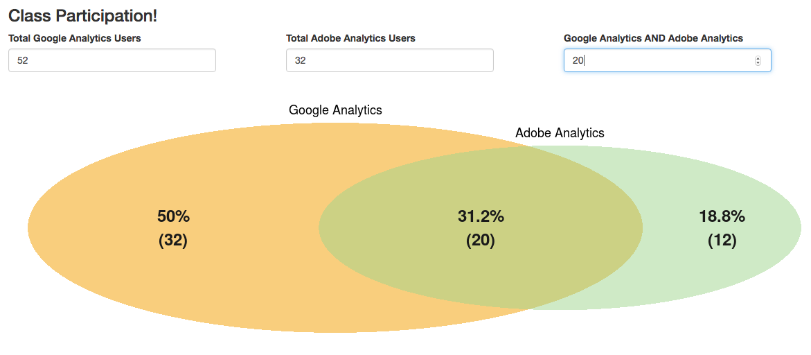
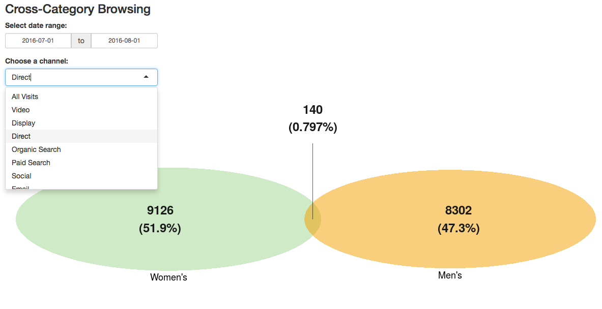

```{r setup, include=FALSE}
knitr::opts_chunk$set(echo = TRUE)
```

## Example 3: Venn Diagram

This is an example of a visualization built using `shiny` (web-enablement) that was then repurposed for an entirely different use.

The first example, shown below, is available at [https://gilligan.shinyapps.io/eMetrics_Venn/](https://gilligan.shinyapps.io/eMetrics_Venn/), if you want to try it out.



`shiny` apps historically required two files, although the package has been updated to enable using a single file. 

### server.R
The code that runs behind the scenes (note that _most_ of the code is really just setting up the formatting options for the Venn diagram itself):
```{r eval=FALSE}
library(shiny)
library(VennDiagram)

shinyServer(function(input, output) {
  
  output$vennDiagram <- renderPlot({
    
    # Only plot the Venn diagram if the input values are legit (the input values
    # are all available and the intersection area isn't greater than either individual set). 
    if(as.numeric(req(input$adobeGoogle)) <= as.numeric(req(input$adobe)) &&
       as.numeric(req(input$adobeGoogle)) <= as.numeric(req(input$google))){

      draw.pairwise.venn(area1 = as.numeric(input$google),
                         area2 = as.numeric(input$adobe),
                         cross.area = as.numeric(input$adobeGoogle),
                         category = c("Google Analytics","Adobe Analytics"),
                         fill = c("#F29B05","#A1D490"),
                         ext.text = TRUE,
                         ext.percent = c(0.1,0.1,0.1),
                         ext.length = 0.6,
                         label.col = rep("gray10",3),
                         lwd = 0,
                         cex = 2,
                         fontface = rep("bold",3),
                         fontfamily = rep("sans",3), 
                         cat.cex = 1.5,
                         cat.fontface = rep("plain",2),
                         cat.fontfamily = rep("sans",2),
                         cat.pos = c(0, 0),
                         print.mode = c("percent","raw")
                         )
    }
  })
})
```

### ui.R
The code for the user interface:
```{r eval=FALSE}
library(shiny)

shinyUI(fluidPage(
  
  # Application title
  titlePanel(h3("Class Participation!")),

  # Sidebar with a slider input for number of bins
  fluidRow(
    column(4,numericInput("google", label = "Total Google Analytics Users", value = NULL)),
    column(4,numericInput("adobe", label = "Total Adobe Analytics Users", value = NULL)),
    column(4,numericInput("adobeGoogle", label = "Google Analytics AND Adobe Analytics", value = NULL))
    ),

    # Show a plot of the generated distribution
  fluidRow(
      column(12,plotOutput("vennDiagram"))
    )
  )
)
```

### Repurposing to Use Segments
The example above, obviously, was just a demo for a conference presentation. But, the demo was actually inspired by a real-world use case, which is the visualization of two different segments of traffic to a site.

This example is available at [https://gilligan.shinyapps.io/segmentsVenn/](https://gilligan.shinyapps.io/segmentsVenn/).

It shows the volume of sessions from each segment and the degree to which traffic fell in both segments (the overlapping area), and provides the user with two settings that trigger a re-query of the data and an update of the diagram:
* Changing the date range
* Choosing a channel



