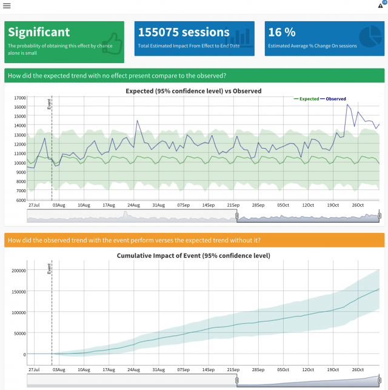

```{r example4-setup, include=FALSE}
knitr::opts_chunk$set(echo = TRUE)
```

This is a Shiny app made to test if an event has a statistically significant effect.

It connects to your Google Analytics data via an ancestor of `googleAnalyticsR`, displays it in a Shiny application styled with `shnydashboard`, applies Bayesian statistics using `CausalImpact` and then displays the results in an interactive HTMLwidget for time-series called `dygraphs`.

Try out the [Shiny App](https://gallery.shinyapps.io/ga-effect/) here.



A full introduction [blog post](http://online-behavior.com/analytics/statistical-significance) is available on the Online Behavior blog, and you can dive more into the technical details via the 
[How I made GA Effect](http://markedmondson.me/how-i-made-ga-effect-creating-an-online-statistics-dashboard-using-reais) blog post.