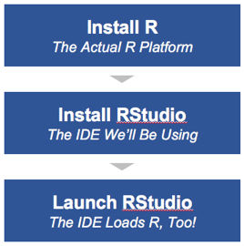

To use R, you need to perform two one-time installations:

An "IDE" is an "integrated development environment." Essentially, it's an interface to some underlying development platform (in this case, that platform is R). Think of R like it's the engine for your car. It's there, and it's doing the actual work of moving the vehicle around, but you can keep the hood (or bonnet!) closed most of the time and just operate the vehicle from the driver's seat.

## Install R

Installing R is pretty straightforward. Just go to the home page of [The Comprehensive R Archive Network](https://cran.r-project.org/)] (henceforth and forthwith referred to as "CRAN" -- that's where many/most of the packages you will use will be housed for download and installation), select the link for your operating system, and download and install it.

That's it. Periodically, new releases will come out and you may need to download newer versions.

## Install RStudio

R itself comes with its own R Console, where you can write R commands and run programs, but it is highly recommended to also install [RStudio](https://www.rstudio.com/home/), as it makes working with R a lot easier.

_Note: RStudio is by no means the **only** R IDE out there. However, it is one that is widely available, is available across different operating systems, and is well-maintained._

For now, just download and install RStudio Desktop from the [RStudio download page](https://www.rstudio.com/products/rstudio/download/). 

If you're not able to install applications on your local computer due to IT restrictions in your organization, you can use RStudio in a cloud environment for free at [RStudio Cloud](https://rstudio.cloud/).

## The RStudio Interface

RStudio features 4 panes for common R tasks:

* **Bottom left:** The R console as you would see if launching normal R
* **Top left:** An editor for writing R scripts
* **Top right:** A helper pane for importing files, seeing R objects, etc.
* **Bottom right:** File explorer, package list, Viewer, etc.

All of the above are configurable.

## Using RStudio

Generally, you will use the console just as a scratchpad to test out R commands. But, most of your work will be carried out in the R script editor, as it's a good habit to be able to reliably reproduce your work, and having that work save-able in a script file means you can refer back to it at any point. Oh... and when you have it saved in a file, you've got a file and code that is easier to send to someone else.

Note that the script editor and the console behave identically in many ways. In other words, if you copy a snippet of code from the script editor and paste it into the console, it will execute fine. Likewise, if you enter a command in the console and then want to incorporate that code into a script, you can simply copy and paste it from the console history into the script editor.

The RStudio team is very active in the R community. As such, they regularly launch useful features of the R platform, and those features are consistently available in and compatible with RStudio. As a matter of fact, this entire website was built in (and is maintained using) RStudio using a delivery mechanism called RMarkdown!

## RStudio Server

RStudio is essentially a custom web browser, which means that it has almost the exact same interface on the desktop as its online server option, RStudio Server.  This runs in a browser, giving users the same access to a configured server with say custom packages. We're not going to go into a lot of detail about RStudio Server here, but you can read up about the what, why, and how of RStudio Server in [this blog post](http://code.markedmondson.me/setting-up-scheduled-R-scripts-for-an-analytics-team/).
