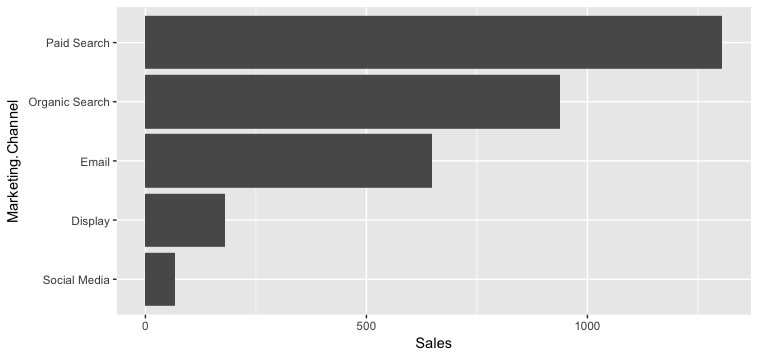

`ggplot2` is one of the most downloaded R packages and probably the one that brought Hadley Wickham to fame.  

The "grammar of graphics" philosophy it supports not only lets you create professional looking plots, but once you have mastered its syntax should encourage you to think about plots in a more structured manner.

The syntax does take time to master though, so take time to check out the [ggplot2 website](http://ggplot2.tidyverse.org/reference/index.html) and the [ggplot2 cookbook](http://www.cookbook-r.com/Graphs/) which will walk you through common tasks. The author still refers to these!

## The Mindset for "Building" a Plot

While there are lots of ways to head down into the weeds, the _core_ of building a ggplot is the following:

1. Call the `ggplot()` function. Primarily, this just indicates what data set will be plotted (using the `data=` parameter). And, when possible and when it makes sense, doing some light "mapping" of that data to core aspects of the plot (using `mapping = aes()`). Note that you can pass the function more data than you're actually going to plot, and you can override aspects of both `data` and `mapping` in subsequent steps.

2. _Add_ (we actually use the `+` sign) one _or more_ `geom` functions, which lays out the type of visualization you want. The image lower on this page shows an extensive list of these. One way to think about it is to consider a chart where you want a line for one set of data and a bar for another set of data (a not-too-uncommon thing to do in Excel). This would use a `geom_bar()` geom and a `geom_line()` geom. The data _set_ that will be plotted is already specified (in the `data=` parameter of `ggplot()`), but we still _may_ need to do some additional _mapping_ within the geom. For instance, if the `data=` parameter was time-series data that included users, sessions, and pageviews, the `mapping=aes()` within the `geom_line()` function would need to specify which of the metrics to plot on the y axis (e.g., `geom_line(mapping = aes(y = sessions)))`.

3. Optionally (but often needed), _add_ (again, with the plus sign) "theme" specifications. These are used to tweak the styles: how thick of a line around the plot, whether to include major and/or minor x and or y gridlines (and what color and thickness to make them), where to locate the legend (or not to have a legend at all). Typically, we can start with a [predefined theme](http://ggplot2.tidyverse.org/reference/index.html#section-themes) and then just tweak (override) specific elements, similar to how CSS can be loaded from external files and then overridden with styles defined more closely to the specific element being formatted on a web page.

Visually, you can think of these three steps like this:

<div align="center">

</div>

**Note**: The _order_ of steps 2 and 3 does not matter. This is, after all, addition. As a best practice, though, keeping the buildup of a visualization in this order makes logical sense: initiate the plot _then_ define the different layers _then_ apply styling. But, it's not technically required to perform the latter steps in this order.

If you can lock in on this basic model, almost everything else is fairly readily Google-able. The above covers four things that we're going to dive into a little bit deeper:

* *Data source* - its easiest to use a tidy data source in long format
* *Geoms* - geometric objects, the type of plot to produce.  Line charts, bar charts, tiled plots etc.
* *Aesthetics* - this specifies which variables in your data will vary and be plotted. In many ways, "aesthetics" is a misnomer -- you actually control the look and feel of plots using _themes_. So, if you want a plot that is "aesthetically pleasing," you will spend more time adjusting the theme applied to the plot -- it will have very little to do with the _aesthetics_ (`aes()`).
* *Themes* - think of the theme like styles and CSS in HTML -- they're what you use to tweak and refine the specifics of the font, colors, spacing, and visibility of different "non-data" elements of the visualization.

There are other aspects of `ggplot2` that we're _not_ going to get into here. To scratch the surface, though, below is a brief explanation of a few more of the components of the `ggplot2` world:

* *Coordinate systems* - usually you'll be in x-y, but polar and more exotic systems are possible
* *Scales* - How your variables map onto the coordinate system (e.g. a log scale)
* *Statistics* - Statistics applied to the data before plotting - most common is binning, such as for histograms, and smoothers such as trend lines

Thinking about what you want to produce via the components above will get you to your desired plot quicker. 

## Data Sources

_Primarily_, the data that you are plotting gets passed as the first argument (the `data=` argument) of the `ggplot()` function. This is just like Excel if you simply highlight a set of data and then click to generate a chart. Now, that is almost never the "final chart as you really want it displayed." The same goes for `ggplot()` -- when you specify the `data=` argument, you are really just defining the rough contours of the final plot. 

There _may_ even be data that is not in the data frame specified in this `data=` argument that, ultimately, you will include in your plot! That's fine -- `ggplot2` is set up for that.

As already noted a couple of times, the tidier and longer you can get your data (fewer columns, more rows!), the better.

## Geoms

Think of the different "geoms" as different "layers" that are added to the plot. You _must_ have _at least one_ geom. But, in many cases, you will have multiple geoms.

The [ggplot2 cheatsheet](https://www.rstudio.com/wp-content/uploads/2015/03/ggplot2-cheatsheet.pdf) is a great -- if not particularly eye-friendly -- resource that groups geoms by the type of data you have. The first page of this cheatsheet is below, and you can always get to it from RStudio by selecting **Help>>Cheatsheets>>Data Visualization with ggplot2**. See how quickly you can find the geom for a line chart (hint: it's called `geom_line()`). 


&nbsp;<br>
If your eye went straight to it, you are unique! (If you're still looking, it's in the very last column about halfway down).

Geoms, like many components of R, are just functions. They are tied to specific types of visualizations, though. In simple situations, you won't need to pass _any_ arguments to the specific geom function. If you've already defined the `data=` and the `mapping = aes(...)` arguments that you need to use for the geom in the `ggplot()` call, then you can just add the geom itself (e.g., `+ geom_line()`). More often than not, though, you will need to specify _which_ data to plot (as the `data=` argument for the geom), as well as, possibly, some additional _aesthetic mappings_ that are specific to that geom (we'll get to that very shortly!).

You may be wondering "Why would I have multiple geoms?" A few examples:

* A bar chart with a line chart on it (`geom_bar()` + `geom_line()`)
* A bar chart with each bar labeled with its value (`geom_bar()` + `geom_text()`)
* A bar chart where the bars in the top quintile are highlighted in a different color (`geom_bar()` + ... another `geom_bar()`)

This does _not_ mean that, if you're plotting a line chart with three different series (e.g., visits over time by device category) that you need three separate geoms. A single geom can plot multiple lines, but that gets us into mappings and aesthetics, which we'll cover next!

## Aesthetics

Aesthetics are defined using the `aes()` function, virtually always (maybe _actually_ always) as the value for a `mapping=` parameter. There are three main things to know about aesthetics:

* They are only minimally about "style." Instead, they are, truly, a _mapping_ of which aspects of the data will be used where and for what. In simpler visualizations -- like a column chart -- you simply need to specify ("map") which data to use for `x` value (`mapping = aes(x = [where the x values are])`) and what to use for the `y` value (`mapping = aes(x = [where the x values are], y = [where the y values are])`).
* They can be specified inside the `ggplot()` function, inside the `geom_xxx()` functions _or_ as a combination of both of these. For instance, if your x values (e.g., "date") are going to be the same for all of the "layers" of the plot, then you can specify it in the `aes()` call inside of `ggplot()`. But, if you have different y values for different layers, then you need to specify that aspect of the mapping as `aes()` calls within each individual geom.
* They support _inheritance_. If you are familiar with CSS, then it's useful to think of aesthetics as being similar to the "cascading" nature of styles: an aesthetic mapping (e.g., `x=` or `y=`) defined in the `ggplot()` function call is available to every subsequent geom. _But_, if a `mapping = aes()` argument is added _within_ a geom, then it can override the mapping that is in the `ggplot()` function. These are selective -- just like styles are for CSS -- if `x` and `y` mappings are defined inside `ggplot()`, and then a mapping for `y` is included in `geom_line()`, then the `x` mapping will persist from the `ggplot()` definition, while the `y` value will use what is specified inside `geom_line()`.

_<whew>_ Confused? It can be a bit! But it should start to make sense fairly quickly.

## Themes

_Themes are just styling_. That's the key. A simple horizontal bar chart using `ggplot2` with no theme applied looks like this:



&nbsp;<br>
Solely through the addition of themes, the chart can be transformed to look like this instead:


For a blow-by-blow explanation of the steps involved in that transformation, check out [How to Build a Brain-Friendly Bar Chart in R](https://rpubs.com/tgwilson/ggplot-meets-lea-pica-and-domo). Note that the _color of the bars_ is not something that is controlled by the theme. That's actually an attribute of the geom (`geom_bar` in this case).

In general, themes are simultaneously: conceptually pretty straightforward, a little tricky to grasp at first, and maddening when it comes to certain specific tweaks. The _critical_ things to understand are a bit of a chicken-and-egg:

* `theme()` is the function used to build/modify a theme, and it has a _ton_ of arguments (see the [theme reference](http://ggplot2.tidyverse.org/reference/theme.html) or `?theme()` for a complete list). These just take a bit of getting used to, but there is cascading/inheritance that goes on even within these arguments. For instance:
    + `line` is an argument for defining the color, width, and style of _all_ of the lines in the visualization
    + `axis.line` specifies _just_ the color, width, and style of the x- and y-axes. If this isn't defined, then it will just use the properties for `line` (which, if not defined, just uses the defaults). If `line` specifies a line color, and `axis.line` does not explicitly override it, then the axes will be the color specified by `line`
    + `axis.line.x` controls _just_ the x-axis. The x-axis will first look to properties defined in `axis.line.x` and use those. Any properties not defined there, but defined in `axis.line`, will use the `axis.line` definitions. Anything _still_ not defined will use the properties defined in `line`. And, anything that's still left undefined will use the defaults.

* `element_xxx()` are a series of functions that actually define the properties of text (`element_text()`), lines (`element_line()`), borders and backgrounds for the plot and panels (`element_rect()`), and "don't display this element" (`element_blank()`). In the example above, `axis.line = element_blank()` was used to turn off the axis lines, for instance. See the [theme elements page](http://ggplot2.tidyverse.org/reference/element.html) or `?element_text()` for details on the different arguments for elements.

Got it? Now, let's add just a few more things about themes:

* There are some built-in themes with `ggplot2` that can be your "starting point." I like to use `theme_light()` or `theme_bw()`, but you can see the full list of these on the [Complete themes](http://ggplot2.tidyverse.org/reference/ggtheme.html) page.

* The [`ggthemes` package](https://cran.r-project.org/web/packages/ggthemes/vignettes/ggthemes.html) has a number of additional themes that can be used as is or as a starting point. This includes a (Stephen) Few theme, an (Edward) Tufte theme, a FiveThirtyEight.com theme, a WSJ theme, and more.

* _Themes are additive!_ Regardless of what you use as your starting point (either of the above options...or nothing), simply adding an additional `theme()` call to the build of your plot lets you selectively override aspects of the theme you started with.

* Because you will likely want to use the same theme in multiple visualizations, you will likely want to make your own "theme" function that you can call for any visualization (and then selectively tweak as needed in the visualization definition itself). This can actually be in a separate file (that then gets "sourced" using `source()` or even in your own package!).

Bringing these points together, below is the code that was used to generate the bar chart above. 

```
my_theme <- function(){
  theme_light() +
    theme(text = element_text(family = "Open Sans"),  
          panel.grid = element_blank(),
          panel.border = element_blank(),
          axis.title = element_blank(),
          axis.ticks = element_blank(),
          axis.text.x = element_blank(),
          axis.text.y = element_text(size = 9, color = "gray10"))
  }
  
ggplot(channel_data, aes(x = Marketing.Channel, y = Sales)) +
  geom_bar(stat = "identity") + 
  coord_flip() +
  scale_y_continuous(expand = c(0, 0)) +
  my_theme()    # THIS IS WHERE THE "STEP #3 - THEME" PIECE IS HAPPENING
```

Focus on how the _theme_ works here -- not so much on the `ggplot()`, `geom_bar()`, mysterious `coord_flip()` (the same geom is used for both horizontal and vertical bar charts, so we have "flip the coordinates" to make it horizontal), and `scale_y_continuous()` (a nuisance in `ggplot` -- axes don't cross at 0 by default).

The highlights:

* The `my_theme()` function actually defines the theme. That way, it can be easily called/applied in multiple visualizations
* `theme_light()` is the "starting point" theme
* _All_ theme-controlled text is set to use `Open Sans` as the font
* A lot of the lines are turned off ("panel" and "axes") using `element_blank()`
* The y-axis text gets a size and color specified (but will already be `Open Sans` because it inherits that from `text`)
* The theme is applied in the actual building of the plot by adding `+ my_theme()`

I _could_ have added additional `+ theme()` calls to tweak what is defined in `my_theme()` further for this specific plot.

**A Handy (Obscure) Tip on Debugging**: Especially when it comes to tweaking the spacing in a plot, the `debug = TRUE` flag inside `element_text()` can be very handy. For whatever reason, it isn't often discussed online.

For the bar chart above, there is this line defining the y-axis text:

```
axis.text.y = element_text(size = 9, color = "gray10")
```

We can modify that by (temporarily) adding a `debug = TRUE` flag if we want to get a better understanding on the exact range of the y-axis text area:

```
axis.text.y = element_text(size = 9, color = "gray10", debug = TRUE)
```

Now, when we build the plot, it looks like this:


This is similar to inspecting an element using developer tools in a browser, in that it draws a solid rectangle behind the complete text area and adds a little circle where each label is anchored (which can be useful in adjusting padding/margins).

Make sense? Let's now walk through an actual example where we build up a full plot and then play around with it a bit!

## Example Workflow

_This example requires having a `web_data` data frame. You can either load up some sample data by completing the [I/O Exercise](exercise2-io.html) (which is what is shown in the details below), or, if you have access to a Google Analytics account, you can use your own data by following the steps on the [Google Analytics API page](api-google-analytics.html)._

```{r categorisation, echo=FALSE}
library(knitr) # used for kable that makes nice RMarkdown tables
web_data <- read.csv("./data/gadata_example_2.csv", stringsAsFactors = FALSE)
```

Once you have a `web_data` data frame to work with, the command `head(web_data)` should return a table that, at least structurally, looks something like this:

```{r}
kable(head(web_data))
```

Now, we can get to visualizing!

### 1. Get the Data Ready and Tidy  

While it's possible to use "wide" data, it's generally easiest to always _start_ with tidy "long" data, so you can quickly repeat what you have learned/applied before.

```{r ggplot2, message=FALSE}
## We can use the newer tidyr() package the gather() function to tidy up the data
library(tidyr)
library(dplyr)

## call the key column 'variable' and the value colum 'value' and 
## gather all variables apart from date, channelGrouping and deviceCategory
web_data_tidy <- web_data %>% 
  select(-X) %>%   ## get rid of column X
  gather(variable, value, -date, -channelGrouping, -deviceCategory)
head(web_data_tidy)
```

`gather()` is the opposite of `spread()` - it "unpivots" data. This transforms the data from having 7 columns to having 4 without any loss of data.

Example:

```{r}
web_data %>% filter(date == "2016-01-01", channelGrouping == "(Other)", deviceCategory=="desktop")
web_data_tidy %>% filter(date == "2016-01-01", channelGrouping == "(Other)", deviceCategory=="desktop")
```

### 2. Make Sure All of the Columns are the Right Class 

In this case, we're going to make the date column a `Date` object.

You could also choose to make factors out of your categories, as they let you set the order of colours in the legends a bit easier.

**Note**: Outside of applying statistical methods, converting columns to be factors will often come into play when you want to control the order of nominal or ordinal variables. This gets a little confusing, in that there are "unordered" factors and "ordered" factors, and you do _not_ actually need an ordered factor to control the order in a plot (!). We're not going to dive into this here, as that's heading down into the weeds a bit. But, make a mental note that order _can_ be controlled when using nonmetric variables. And it's a quick Google search to get the specifics.

```{r message=FALSE}
str(web_data_tidy)

web_data_tidy$date <- as.Date(web_data_tidy$date)

## we will only look at sessions
library(dplyr)
plot_data <- web_data_tidy %>% filter(variable == "sessions")

```

### 3. Create a Plot Object Called `gg`

We can use the `ggplot()` function to create a plot that we're going to call `gg`. This call includes your data and any known aesthetics (mappings) that you want to apply to all of the plots that you will layer in. We can also go ahead and set the basic theme here. `theme_minimal()` is a nice, clean one to start with.

As we have made "long" tidy data, we know that our x variable will be `date`, but also our y variable will be in the `value` column, so we can set these as defaults in the `aes()` (aesthetics) call:

```{r}
library(ggplot2)
## I don't know why, but I always call them gg, as do many other folks!
gg <- ggplot(data = plot_data, aes(x = date, y = value)) + theme_minimal()
```

### Let the Fun Begin!

Experiment with adding various elements to your `gg` object using `+`.  Once you have found something you want to keep, assign it to `gg` and then carry on to the next feature.

Any aesthetics or statistics you haven't specified in the global line, you will need to add in the `geom` you are adding.  Note that because we have put the data in the first line, we don't need to specify it again.

```{r, fig.height=6, fig.width=10}
## Let's make some line plots
gg + geom_line()

## Hmm, too much data in there, let's colour by the channelGroupings
gg + geom_line(aes(colour = channelGrouping))

## We have desktop, mobile and tablet all in there, let's separate them out as "facets."
## We haven't discussed facets so far here, but, hopefully, it makes some sense what is
## happening. We're just defining which dimensions to use for the rows (none, in this case,
## as signified by the ".") and columns (deviceCategory in this case). Check ?facet_grid()
## for details!
gg + geom_line(aes(colour = channelGrouping)) + facet_grid(. ~ deviceCategory)

## I prefer it one over the other. See how this just swaps the row and column definitions
## in facet_grid()?
gg + geom_line(aes(colour = channelGrouping)) + facet_grid(deviceCategory ~ .)

## Let's try an area plot -- just changing the geom that we're using!
gg + geom_area(aes(colour = channelGrouping, group = channelGrouping)) + facet_grid(deviceCategory ~ .)

## Ahh, area plots colour by scale 'fill' rather than scale 'colour' (see ?geom_area)
gg + geom_area(aes(fill = channelGrouping, group = channelGrouping)) + facet_grid(deviceCategory ~ .)

## Okay, let's keep that for now
gg <- gg + geom_area(aes(group = channelGrouping, fill = channelGrouping)) + facet_grid(deviceCategory ~ .)
```

The point above is to show how modifications can be quickly added as you try out ideas.

A little more styling, and we are done with this example:

```{r, fig.height=15, fig.width=10}
## Make the colours nicer
gg <- gg + scale_fill_brewer(palette = "Blues")
## Add a title
gg <- gg + ggtitle("Sessions per device category")
## Rename the x and y axis
gg <- gg + xlab("Date") + ylab("Sessions")
## Change the legend title
gg <- gg + guides(fill = guide_legend(title = "Channel Grouping"))
## Put the legend at the bottom
gg <- gg + theme(legend.position = "bottom")
## Print the final plot
gg
```

> Disclaimer, I don't think area plots are very clear but they look pretty ;)

## Facets Can be Two Dimensional (Of Course!)

```{r, fig.width=10}

gg <- ggplot(data = web_data_tidy, aes(x= date, y = value)) + theme_linedraw()
gg <- gg + geom_line(aes(color = deviceCategory))
gg <- gg + facet_grid(deviceCategory ~ channelGrouping) 
gg
```

## Lets Do a Bar Plot

But call it the right name - *geom_col* (`geom_bar` is for count data)

```{r, fig.width=10}
gg <- ggplot(data = web_data_tidy) + theme_bw()
gg <- gg + scale_fill_brewer(palette = "Blues")
gg + geom_col(aes(x = channelGrouping, fill = deviceCategory, y = value), position = "dodge")

```

