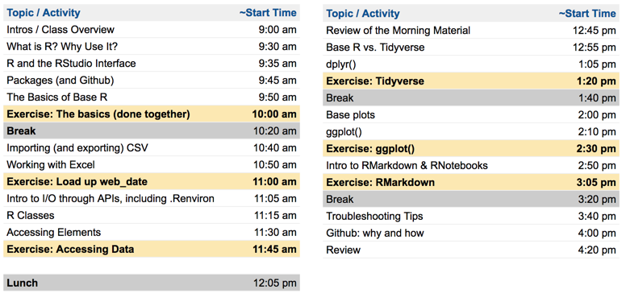
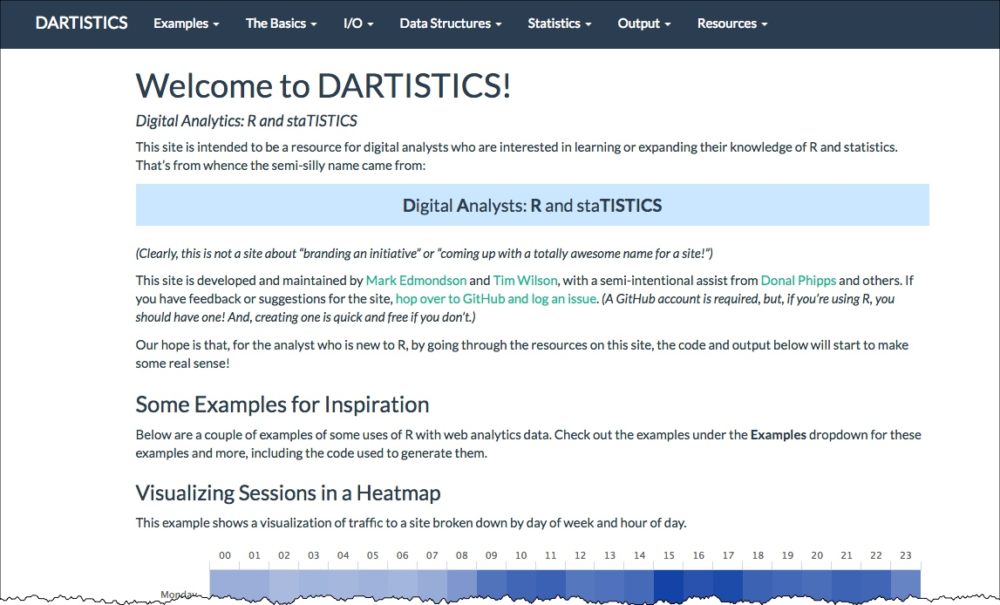

```{r setup, include=FALSE}
options(htmltools.dir.version = FALSE)

library(googlesheets)  # Read from Google Sheets
library(tidyverse)     # Just 'cuz... we'll need it
library(ggthemes)      # Additional themes
library(scales)        # For visualizing

# Load separate file that has theme definitions
knitr::read_chunk('ggplot_themes.R')

# Function for plotting a vertical bar chart
plot_bar <- function(data){
  p <- ggplot(data, aes(x=label, y=student_count)) +
    geom_bar(stat="identity", fill="#6799b8") +
    geom_text(aes(label=student_count), size=10, vjust=-0.5) +
    scale_y_continuous(expand = c(0, 0)) +
    coord_cartesian(ylim=c(0, max(data$student_count)+0.25)) +
    theme_bar
  
  # Return the plot
  p
}

# Function for plotting a horizontal bar chart
plot_bar_horiz <- function(data){
  p <- ggplot(data, aes(x=label, y=student_count)) +
    geom_bar(stat="identity", fill="#6799b8") +
    geom_text(aes(label=student_count), size=7, hjust=-0.5) +
    scale_y_continuous(expand = c(0, 0), limits = c(0,max(data$student_count)+0.25)) +
    coord_flip() +
    theme_bar_horiz +
    theme(axis.text.y = element_text(size=20))
  
  # Return the plot
  p
}

# This data doesn't change much, so, if it's changed, uncomment the below and run just
# the commented lines below to refresh the underlying data. Otherwise, it will just read
# it from a static RDS (which isn't available on Github -- it has to be created locally).

# # Register the Google Sheet w/ survey responses
# survey_id <- Sys.getenv("GS_SURVEY_ID")
# survey_id <- "1P0uPe2nXASfbhaB8RT4AlDPWBWxndIPmr0KwCqwv0iA"
# survey_responses <- gs_key(survey_id)
# 
# # Load the data from the Google Sheet
# survey_responses_data <- gs_read(survey_responses, ws = "Form Responses 1") %>%
#   as.data.frame(stringsAsFactors=FALSE)
# 
# write_rds(survey_responses_data, "survey_responses_data.rds")

survey_responses_data <- read_rds("survey_responses_data.rds")

```

```{r default-theme, include=FALSE}
# Pulls in theme definitions from the ggplot_themes.R file
```

.container[
.left-col-5[.first[# About...you!
<div style="color: #150E91">
## Your Name
## One thing you hope to get out of this training</div>]]
.left-col-7[.last[]]
]

---

## What operating systems are you using?

```{r os, echo=FALSE, message=FALSE, include=TRUE, fig.width=11, fig.height=7}

# Get the counts and clean 'em up a bit
os <- group_by(survey_responses_data, 
               `What type of laptop (operating system) will you be bringing for the training?`) %>% 
  summarise(n())
names(os) <- c("label","student_count")

plot_bar(os)

```

---
## R Familiarity

```{r familiarity, echo=FALSE, message=FALSE, include=TRUE, fig.width=11, fig.height=7}

# Get the counts 
r_familiarity <- group_by(survey_responses_data, `Which of the following best describes your current familiarity with R?`) %>%
  summarise(n())

# Clean up the column names
names(r_familiarity) = c("label","student_count")

# Shorten the responses... and cheat by adding a row for the value
# that had NO responses
r_familiarity <- mutate(r_familiarity, label = 
                          gsub("Have heard of R and read a little bit about it, but have never tried to use it",
                               "Have heard of R\nbut never used it", label)) %>%
  mutate(label = gsub("Have dabbled with R, but never got comfortable enough with it to use it heavily",
         "Have dabbled with\nR just a little bit", label)) %>%
  mutate(label = gsub("Occasionally use the platform",
         "Occasionally\nuse the platform", label)) %>%
  rbind(data.frame(label = "Use R all the time!", student_count = 0))

# <Sigh> Reorder things
r_familiarity <- mutate(r_familiarity, label =
                          factor(label, levels = c(
                          "Have heard of R\nbut never used it",
                          "Have dabbled with\nR just a little bit",
                          "Occasionally\nuse the platform",
                          "Use R all the time!")))

plot_bar(r_familiarity)

```

---
## What data sources are you interested in?

```{r data_sources, echo=FALSE, message=FALSE, include=TRUE, fig.width=11, fig.height=7}

# Get the counts and clean 'em up a bit
data_sources <- select(survey_responses_data, 
                       `Which of the following data sources do you ultimately expect to be using R with?`)

names(data_sources) <- "label"

# Google Sheets... commas... (manual data fix)
data_sources$label <- gsub("AT FIRST, JUST GA","AT FIRST - JUST GA",data_sources$label)

# Put all values in a single vector
data_sources <- paste(data_sources$label, collapse=", ") %>% strsplit(", ") %>%
  as.data.frame(stringsAsFactors=FALSE)

names(data_sources) <- "label"

data_sources <- group_by(data_sources, label) %>% 
  summarize(student_count = n()) %>%
  arrange(student_count)

# Truncate the descriptions that are too long
data_sources <- mutate(data_sources, label = if_else(nchar(label) > 30, 
                                                     paste0(substr(label,1,26),"..."),
                                                     label))

# Order the levels of the actual data sources based on how they're arranged in the table (descending)
data_sources$label <- factor(data_sources$label, levels=data_sources$label)

plot_bar_horiz(data_sources)

```

---
## Today's (Rough) Agenda



---
## Resources


