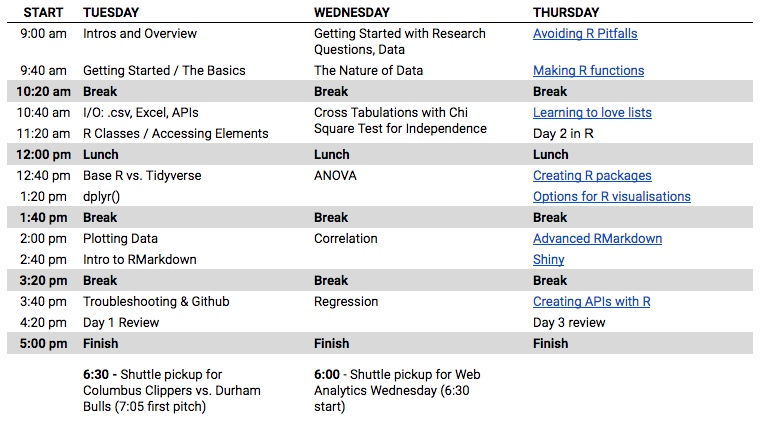

class: inverse

```{r setup, include=FALSE}
options(htmltools.dir.version = FALSE)

library(googlesheets)  # Read from Google Sheets
library(tidyverse)     # Just 'cuz... we'll need it
library(ggthemes)      # Additional themes
library(scales)        # For visualizing

# Load separate file that has theme definitions
knitr::read_chunk('ggplot_themes.R')

# Function for plotting a vertical bar chart
plot_bar <- function(data){
  p <- ggplot(data, aes(x=label, y=student_count)) +
    geom_bar(stat="identity", fill="#6799b8") +
    geom_text(aes(label=student_count), size=10, vjust=-0.5) +
    scale_y_continuous(expand = c(0, 0)) +
    coord_cartesian(ylim=c(0, max(data$student_count)+2)) +
    theme_bar
  
  # Return the plot
  p
}

# Function for plotting a horizontal bar chart
plot_bar_horiz <- function(data){
  p <- ggplot(data, aes(x=label, y=student_count)) +
    geom_bar(stat="identity", fill="#6799b8") +
    geom_text(aes(label=student_count), size=7, hjust=-0.5) +
    scale_y_continuous(expand = c(0, 0), limits = c(0,max(data$student_count)+2)) +
    coord_flip() +
    theme_bar_horiz
  
  # Return the plot
  p
}

# This data doesn't change much, so, if it's changed, uncomment the below and run just
# the commented lines below to refresh the underlying data. Otherwise, it will just read
# it from a static RDS (which isn't available on Github -- it has to be created locally).

# # Register the Google Sheet w/ survey responses
# survey_id <- Sys.getenv("GS_SURVEY_ID")
# survey_responses <- gs_key(survey_id)
# 
# # Load the data from the Google Sheet
# survey_responses_data <- gs_read(survey_responses, ws = "Form Responses 1") %>%
#   as.data.frame(stringsAsFactors=FALSE)
# 
# write_rds(survey_responses_data, "survey_responses_data.rds")

survey_responses_data <- read_rds("survey_responses_data.rds")

```

```{r default-theme, include=FALSE}
# Pulls in theme definitions from the ggplot_themes.R file
```

# Your Instructors
.container[
.left-col-4[.first[<br>
**Tim Wilson**<br>
Analytics Demystified<br>
_R You Ready for R?_]]
.left-col-4[.first[<br>
**Dr. Michael Levin**<br>
Otterbein University<br>
_Stats Man!_]]
.left-col-4[.first[<br>
**Mark Edmondson**<br>
IIH Nordic<br>
_The Google GuRu_]]
]

---
.container[
.left-col-5[.first[# Now...you!
<div style="color: #150E91">
## Your Name
## Your Company
## One thing you hope to get out of this training</div>]]
.left-col-7[.last[]]
]


---
## The Next Three Days

The class will run from 9:00 AM to ~5:00 PM each day.



---
# How did I hound you?

```
library(googlesheets)  # Read from Google Sheets
library(tidyverse)     # Just 'cuz... we'll need it

# Register the Google Sheet w/ survey responses
survey_responses <- gs_key("[GOOGLE SHEETS KEY FOR FORM RESPONSES]")
registration_list <- gs_key("[GOOGLE SHEETS KEY FOR REGISTRATIONS]")

# Load the data from the Google Sheets
survey_responses_data <- gs_read(survey_responses, ws = "Form Responses 1") %>%
  as.data.frame()

# Combine first and last name from the registration list (our join key)
registration_list_data <- gs_read(registration_list, ws = "Sheet1") %>%
  as.data.frame() %>% mutate(Name = paste(`FIRST NAME`, `LAST NAME`))

# Combine the data sets
combined_data <- full_join(registration_list_data, survey_responses_data,
                           by = c("Name" = "Your Name"))

# Filter down to the non-responses
missing_responses <- filter(combined_data, is.na(Timestamp)) %>%
  select(EMAIL)
```

---
## How many of you are Columbus-based?

```{r local, echo=FALSE, message=FALSE, include=TRUE, fig.width=11, fig.height=7}

# Get the counts and clean 'em up a bit
local_to_cbus <- group_by(survey_responses_data, `Are you local to Columbus?`) %>% summarise(n())
names(local_to_cbus) <- c("label","student_count")
local_to_cbus$label <- gsub("No","Not Local",local_to_cbus$label) %>%
  gsub("Yes","Local to Columbus",.)

plot_bar(local_to_cbus)

```

---
## What operating systems are you using?

```{r os, echo=FALSE, message=FALSE, include=TRUE, fig.width=11, fig.height=7}

# Get the counts and clean 'em up a bit
os <- group_by(survey_responses_data, 
               `What type of laptop (operating system) will you be bringing for the training?`) %>% 
  summarise(n())
names(os) <- c("label","student_count")

plot_bar(os)

```

---
## Interest in evening activities?

```{r evening, echo=FALSE, message=FALSE, include=TRUE, fig.width=11, fig.height=7}

# Get the counts and clean 'em up a bit
evening <- group_by(survey_responses_data, 
                    `Do you expect to attend the baseball game on Tuesday evening?`,
                    `Do you expect to attend Web Analytics Wednesday on Wednesday evening?`) %>% 
  summarise(n())
names(evening) <- c("Baseball","WAW","student_count")

# We want to generate a value for every combination, so going to spread and re-gather
evening <- ungroup(evening) %>%
  spread(WAW, student_count, fill=0) %>%
  gather(WAW, student_count, -Baseball)

# Adjust the order of the categories
evening$WAW <- factor(evening$WAW, levels=c("No", "Maybe", "Yes"))
evening$Baseball <- factor(evening$Baseball, levels=c("No", "Maybe", "Yes"))

ggplot(evening, aes(Baseball, WAW)) +
  geom_tile(aes(fill = student_count), color="grey70", size = 0.5) +
  scale_fill_gradient(low = "white", high = "#70c4dd") +
  geom_text(aes(label = comma(student_count)), size = 7) +
  theme_heatmap

```

---
## Arrivals and departures?

```{r arrival, echo=FALSE, message=FALSE, include=TRUE, fig.width=11, fig.height=7}

# Get the counts and clean 'em up a bit
arrival_departure <- group_by(survey_responses_data, 
                              `When will you be departing Columbus?`,
                              `When will you be arriving in Columbus?`) %>% 
  summarise(n())
names(arrival_departure) <- c("Departure","Arrival","student_count")

arrival_departure$Departure <- gsub("Thursday afternoon/evening", "Thursday PM", arrival_departure$Departure)
arrival_departure$Arrival <- gsub("morning", "AM", arrival_departure$Arrival)
arrival_departure$Arrival <- gsub(",.*$","", arrival_departure$Arrival)

arrival_departure$Departure[is.na(arrival_departure$Departure)] <- "Local"
arrival_departure$Arrival[is.na(arrival_departure$Arrival)] <- "Local"

# We want to generate a value for every combination, so going to spread and re-gather
arrival_departure <- ungroup(arrival_departure) %>%
  spread(Departure, student_count, fill=0) %>%
  gather(Departure, student_count, -Arrival)

# We want to control the order manually, so turn the values into factors
arrival_departure$Departure <- factor(arrival_departure$Departure, levels=c("Local", "Thursday PM", "Friday"))
arrival_departure$Arrival <- factor(arrival_departure$Arrival, levels=c("Local", "Monday", "Tuesday AM"))

ggplot(arrival_departure, aes(Departure, Arrival)) +
  geom_tile(aes(fill = student_count), color="grey70", size = 0.5) +
  scale_fill_gradient(low = "white", high = "#70c4dd") +
  geom_text(aes(label = comma(student_count)), size = 7) +
  theme_heatmap

```


---
## What data sources are you interested in?

```{r data_sources, echo=FALSE, message=FALSE, include=TRUE, fig.width=11, fig.height=7}

# Get the counts and clean 'em up a bit
data_sources <- select(survey_responses_data, 
                       `Which of the following data sources do you ultimately expect to be using R with?`)

names(data_sources) <- "label"

# Google Sheets... commas... (manual data fix)
data_sources$label <- gsub("AT FIRST, JUST GA","AT FIRST - JUST GA",data_sources$label)

# Put all values in a single vector
data_sources <- paste(data_sources$label, collapse=", ") %>% strsplit(", ") %>%
  as.data.frame(stringsAsFactors=FALSE)

names(data_sources) <- "label"

data_sources <- group_by(data_sources, label) %>% 
  summarize(student_count = n()) %>%
  arrange(student_count)

# Truncate the descriptions that are too long
data_sources <- mutate(data_sources, label = if_else(nchar(label) > 30, 
                                                     paste0(substr(label,1,26),"..."),
                                                     label))

# Order the levels of the actual data sources based on how they're arranged in the table (descending)
data_sources$label <- factor(data_sources$label, levels=data_sources$label)

plot_bar_horiz(data_sources)

```

---
## Statistics Familiarity

```{r stats, echo=FALSE, message=FALSE, include=TRUE, fig.width=11, fig.height=7}

# Get the counts and clean 'em up a bit
stats <- survey_responses_data[,names(survey_responses_data)[grepl("What is your current.*", names(survey_responses_data))]]

# Clean up names
names(stats) <- gsub("^.*\\[", "", names(stats)) %>% gsub("\\]","",.)

# Tidy up
stats <- gather(stats, Concept, Familiarity) %>%
  group_by(Concept, Familiarity) %>%
  summarize(student_count = n())

# We want to generate a value for every combination, so going to spread and re-gather
stats <- spread(stats, Familiarity, student_count, fill=0) %>%
  gather(Familiarity, student_count, -Concept)

# Get the order specified
stats$Concept <- factor(stats$Concept, levels = c("Chi-square", "Standardization (z-score)","ANOVA",
                                                  "Linear regression", "Correlation"))
stats$Familiarity <- factor(stats$Familiarity, levels = c("Not Familiar", "Somewhat Familiar", "Very Familiar"))

ggplot(stats, aes(Familiarity, Concept)) +
  geom_tile(aes(fill = student_count), color="grey70", size = 0.5) +
  scale_fill_gradient(low = "white", high = "#70c4dd") +
  # scale_fill_continuous(na.value = 'salmon') +
  geom_text(aes(label = comma(student_count)), size = 7) +
  theme_heatmap

```

---
## Resources

dartistics.com
