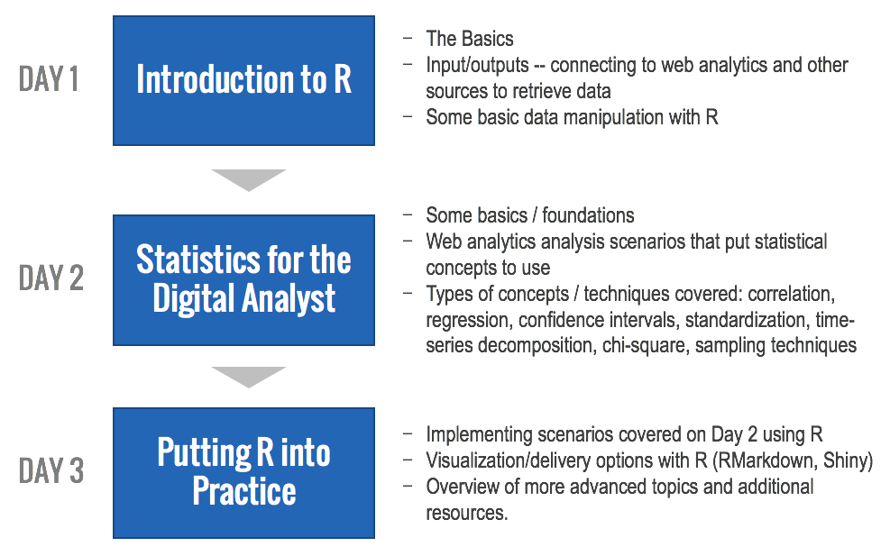

If you are a digital analyst who is looking to dive into R and statistics -- at all or, simply, more deeply -- then this training is for you. **Register [here](https://www.eventbrite.com/e/r-statistics-for-the-digital-analyst-tickets-32412424434)**.

## When and Where

* **When:** June 13-15, 2017, 8:30AM to 5:00PM
* **Where:** 95 Liberty Street, Columbus, Ohio
* **Venue:** [Vue Columbus](http://vuecolumbus.com/meeting-rooms/#rooms) (The Green Room)

## Course Description
The course is a combination of lectures and hands-on examples. The goal is that every attendee will leave with a clear understanding of:

* The syntax and structure of the [R language](https://cran.r-project.org/), as well as the [RStudio](https://www.rstudio.com/) interface
* How to automatically pull data from web analytics and other platforms
* How to transform and manipulate data using R
* How to visualize data with R
* How to troubleshoot R scripts
* Various options for producing deliverables directly from R
* The application of core statistics concepts and methods to digital analytics data

The course is broken down into three core units, with each day being devoted to a specific unit, and the third day bringing together the material taught on the first two days:

The first and third days have a heavy hands-on component to them, so students are expected to bring a laptop so they can work through the exercises on their own. (Let us know if a laptop is not available and we will do our best to provide one, although we cannot guarantee this.)

## Who Should Attend

This training is primarily for digital analysts who have hit the limits of what can be done effectively with Microsoft Excel, the native interfaces of digital analytics platforms, and third party platforms like Tableau. Specifically, it is for digital analysts who are looking to:

* **Improve their efficiency and effectiveness** when it comes to accessing and manipulating data from digital/social/mobile/internal platforms
* **Increase the analytical rigor they are able to apply to their work** -- applying statistical techniques like correlation, regression, standardization, and chi square so they can increase the value they deliver to their organizations

Attendees should be relatively well-versed in digital analytics data. We will primarily be working with Google Analytics data sets in the course, but the material itself is not platform-specific, and the class discussion will include other platforms as warranted based on the make-up of the attendees.

Attendees who currently work (or have dabbled with) R or statistics are welcome. The material goes “beyond the basics” on both subjects. But, attendees who have not used R at all will be fine. We start with the basics, and those basics are reinforced throughout the course.

## Evening Activities
Optional evening activities are included in the registration. These are an opportunity to unwind a bit after attendees brains have been filled up during the day.

Transportation will be provided to and from both activities:

* **Tuesday, June 13th** -- [Columbus Clippers](http://www.milb.com/index.jsp?sid=t445) baseball game. This is the local Triple-A (one step below the major leagues) baseball team. The stadium was built in 2009, and it provides a fun and casual atmosphere to relax in the heart of Columbus, regardless of whether you are a baseball fan or not (and, if you are, you have the opportunity to see some quality baseball get played!).

* **Wednesday, June 14th** -- [Columbus Web Analytics Wednesday](http://cbuswaw.com). As one of the largest and longest continuously running WAWs, attendees will get to hang out over drinks and dinner with the analysts and digital marketers from a range of organizations that all call Columbus home.

These events are both entirely optional, but, for those who attend, dinner will be provided.

## Course Instructors 

### Mark Edmondson

Mark has been actively contributing to and enabling the adoption of R by digital analysts for several years. He is an Englishman based in Copenhagen who has developed many R packages that are widely used by digital analysts who have adopted the platform, including: [googleAnalyticsR](http://code.markedmondson.me/googleAnalyticsR/) (the first and only package that makes use of v4 of the Google Analytics API), [searchConsoleR](http://code.markedmondson.me/searchConsoleR/) (for accessing Google Search Console data), [googleAuthR](http://code.markedmondson.me/googleAuthR/) (usable across any application that needs to use Google authentication), and [googleCloudStorageR](http://code.markedmondson.me/googleCloudStorageR/) (for working with Google Cloud Storage). He also developed [Google Analytics Effect](http://markedmondson.me/how-i-made-ga-effect-creating-an-online-statistics-dashboard-using-reais), an online tool for assessing and quantifying the impact of changes made to a web site by applying Bayesian structural time-series techniques (using R!). And more! He regularly blogs at [markedmondson.me](http://markedmondson.me), where he churns out code and explanations that analysts can directly put to use. And, along with Tim, he built and maintains this very site! By day, he is a Data Insight Developer with [IIH Nordic](http://iihnordic.com/), where, among other things, he is tasked with driving efficiencies in the analytics team using technology to the point that they can cut down to a 4-hour workweek (we’re not kidding). And he’s getting close!

### Tim Wilson

Tim is somewhat newer to R, first having explored the platform in 2013, and then diving in in earnest in the fall of 2015. He is a Texan based in Ohio who spent 2016 not only drastically improving his capabilities with the platform, but taking careful note of where the biggest stumbling blocks were for a digital analyst diving into that world. Those notes were key to the development of this course -- ensuring that the most confusing concepts are addressed clearly and cleanly, as well as ensuring that 100% of the material is grounded in the perspective of a digital analyst. He speaks regularly at industry events around the world on a range of topics, although many of his speaking engagements in 2016 centered around the application and future of R, statistics, and data science in the realm of digital analytics. Tim and Mark teamed up to develop this site, and this 3-day course is the result of their on-going collaboration. By day, Tim is a Senior Partner at [Analytics Demystified](http://analyticsdemystified.com), where he [blogs regularly](http://tim.analyticsdemystified.com) while also working with large clients across a variety of industries to get as much value as they can out of their digital and other data.

### Dr. Michael Levin

Michael is an Associate Professor of Marketing and serves as chair of the Business, Accounting, & Economics Department at [Otterbein University](http://otterbein.edu) in Westerville, Ohio. His research focuses on motivations to use marketing technology, as well as intellectual property and antitrust issues related to technology and retail. He has published in several journals, including _International Journal of Retail and Distribution Management_, _Journal of Business Research_, and the _Journal of Personal Selling and Sales Management_, and he has presented at several management and marketing conferences. He served as the editor for the _Marketing Education Review's_ special issue on teaching innovation. He teaches marketing analytics, retail management, and sales and has won a teaching innovation award. He is also a regular attendee and one of the most popular presenters at Columbus Web Analytics Wednesdays. 

## Pricing and Registration

The course pricing:

* **Early bird** (through March 15, 2017): **$1,695**
* **Full registration** (after March 15, 2017): **$1,995**

Registration is available [here](https://www.eventbrite.com/e/r-statistics-for-the-digital-analyst-tickets-32412424434).

## FAQ

### Why should I attend this course instead of just taking classes through Coursera (or other MOOCs)?
While the material available online for both R and for statistics is vast, and much of that is freely available, what we’ve seen (and feedback we’ve gotten from others) is that it is daunting to actually make the leap from “general examples” -- many of which are person-level, social science data -- to “how do we apply this with digital analytics (web analytics, specifically, but also social, mobile, and other marketing analytics data) specifically?” That is the gap this course aims to fill. It is built around digital analytics examples and scenarios. As such, the course is designed to provide an accelerated path to putting these tools (R and statistics) to real-world use.

### How can I best pitch this class to my manager / my organization?
This is a tough question to answer, as the specific needs of every organization are different. **If** your organization is looking towards the world of "data science," and you and/or your digital analytics organization needs to move in that direction, then this course is a great jumpstart for that. (To be clear, this course will not turn the attendees into data scientists in three days, but the entire course is about bringing _aspects_ of data science into the world of digital analysts).

If your manager/organization is more motivated by visual things, then, perhaps, one or more of these examples will be useful from a, "I'll be equipped to do things like this" perspective:

* [GA Effect](http://online-behavior.com/analytics/statistical-significance) -- an application of a Bayesian structural time-series method to answer the question, "What was the impact of that event (campaign, redesign, channel change, etc.)?" While this was built for use with Google Analytics (by one of the instructors for this course!), the concept and approach is applicable to data from any platform.
* [Forecasting](http://www.dartistics.com/example6.html) -- this is a very simple illustration of forecasting using the Holt-Winters method and R. If you think forecasting isn't something of much use to you, then check out [this post](http://analyticsdemystified.com/adobe-analytics/r-adobe-analytics-metric-move-significantly-part-2-3/) about how forecasts can be used to objectively assess recent results.
* [Text Mining Site Search Data](http://analyticsdemystified.com/google-analytics/exploring-site-search-help-r/) -- if you are using Google Analytics, you can actually [try this out with your own data](https://gilligan.shinyapps.io/ga-site-search/?utm_source=dartistics&utm_campaign=site-search-ga&utm_medium=blog) without doing any coding at all. (A version for use with Adobe Analytics is in the works.)
* [BigQuery Visualizer](http://markedmondson.me/bigquery-visualiser-shiny-app-now-free-and-open-sourced) -- IF you use BigQuery, then this is an app that you can use (or create and extend locally) using R.
* [Random Forests and K-Means Clustering](http://markedmondson.me/intro-to-machine-learning-with-web-analytics-random-forests-and-k-means) -- these are some examples that would appeal to the "I just know we need to be doing more advanced stuff!" mentality. There are several examples there.

The list above doesn't capture the efficiency gains of using R from the perspective of how it can just make it much faster and more readily repeatable to pull data from one or more systems and manipulate it. That, alone, would likely justify the value of adding the platform to your toolset. But, it's a tougher value to illustrate with a pretty picture.

### What should attendees know beforehand?
The only prerequisite for this class is that the student is relatively well-versed in web analytics (any platform). The course starts “from scratch” with R itself (although it doesn’t hurt to already be using the platform -- there is plenty of useful material for those users, too!). And, the course starts “from scratch” with the the statistics material. 

### Will this course be offered online / virtually?
Not at this time. We believe the intense and and hands-on nature of the material, as well as the fact that the material builds on itself over the course of the three days, requires that it be delivered in person.

### Will this course be offered again? If so, when and where?
We hope (and expect) the course to be successful. If it is, then the instructors are all committed to offering it on a regular basis, and we expect to offer it in various locations based on demand. If you are interested in being updated as future offerings are developed, send an email to [tim@analyticsdemystified.com](mailto:tim@analyticsdemystified.com), including where you are located geographically.

### Will there be any post-class support provided?
Yes. All three instructors will be available through email and other channels to answer follow-up questions related to the course material and how students can apply that material to their specific data.

### Is there a discount for students or non-profits?
Contact [tim@analyticsdemystified.com](mailto:tim@analyticsdemystified.com) and we will see what we can do.

### Is there a recommended hotel?
Two hotels within a 10-minute walk of the training space are:

* [The Westin Columbus](http://www.westincolumbus.com/), 310 S. High Street, Columbus, Ohio. Contact Carla Farmer (carlafarmer at westincolumbus dot com or 614-220-7041 and reference the "R Training" for a nominal discount)
* [Comfort Inn & Suites Downtown](https://www.choicehotels.com/ohio/columbus/comfort-inn-hotels/oh508), 650 S High St, Columbus, Ohio

The shuttles for the evening activities will drop off at both of these hotels.

### Why doesn’t this FAQ answer my specific question?
Because it was an oversight. Send your question to [tim@analyticsdemystified.com](mailto:tim@analyticsdemystified.com), and we will both get it answered and, as appropriate, add it here.

